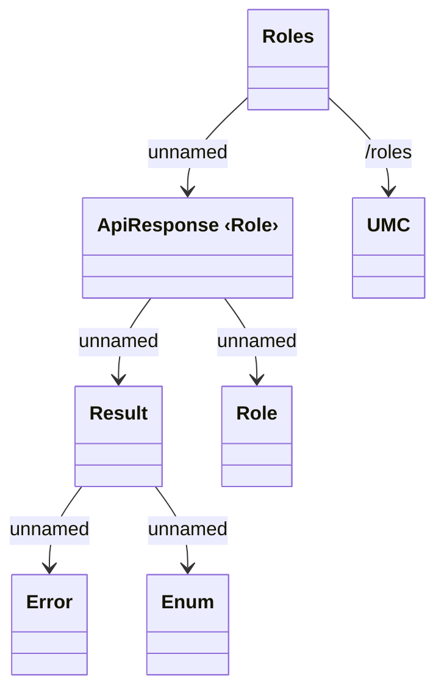

# {ADD LOR-4899/}UMC REST roles

```mermaid
classDiagram
    class ApiResponse_Role["ApiResponse ‹Role›"]
    class Enum["Enum"]
    class Error["Error"]
    class Result["Result"]
    class Role["Role"]
    class Roles["Roles"]
    class UMC["UMC"]
    Roles --> UMC : /roles
    ApiResponse_Role --> Role : unnamed
    ApiResponse_Role --> Result : unnamed
    Result --> Error : unnamed
    Result --> Enum : unnamed
    Roles --> ApiResponse_Role : unnamed
```
