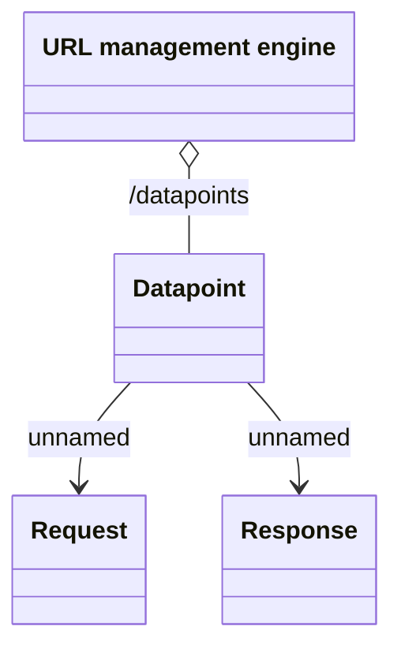

# URL shortener

- **Diagram Type**: Logical
- **Package**: HomerSelect/BSL/Analysis Model/_Interface/Consumed services/URL management engine
- **Diagram ID**: 129680
- **Elements**: 4
- **Connectors**: 3

