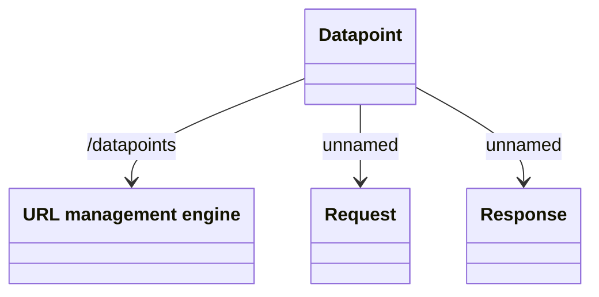

# URL shortener

```mermaid
classDiagram
    class Response["Response"]
    class Request["Request"]
    class Datapoint["Datapoint"]
    class URL_management_engine["URL management engine"]
    Datapoint --> URL_management_engine : /datapoints
    Datapoint --> Request : unnamed
    Datapoint --> Response : unnamed
```
