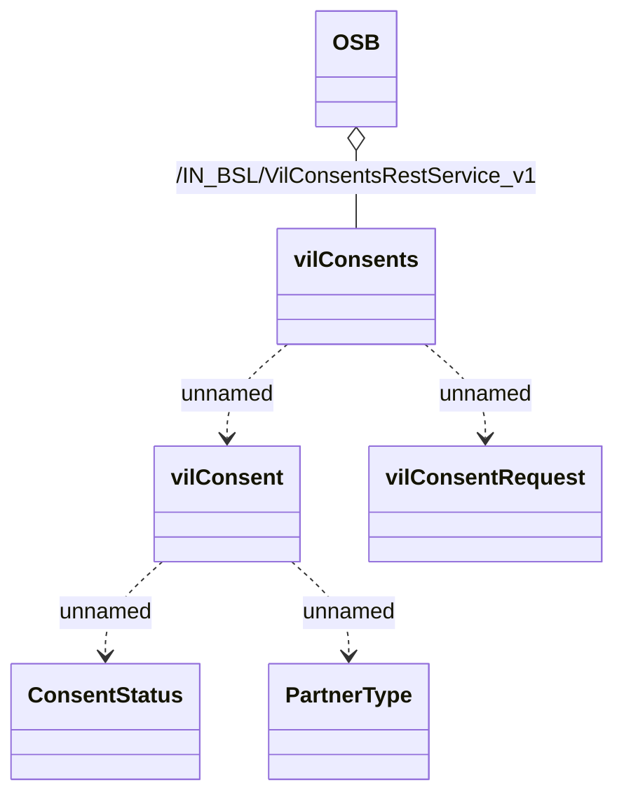

# VIL consent

- **Diagram Type**: Logical
- **Package**: HomerSelect/BSL/Analysis Model/_Interface/Consumed services/VIL consent
- **Diagram ID**: 130106
- **Elements**: 6
- **Connectors**: 5

```mermaid
classDiagram
    class PartnerType["PartnerType"]
    class ConsentStatus["ConsentStatus"]
    class vilConsent["vilConsent"]
    class vilConsentRequest["vilConsentRequest"]
    class vilConsents["vilConsents"]
    class OSB["OSB"]
    OSB o-- vilConsents : /IN_BSL/VilConsentsRestService_v1
    vilConsents ..> vilConsentRequest : unnamed
    vilConsents ..> vilConsent : unnamed
    vilConsent ..> ConsentStatus : unnamed
    vilConsent ..> PartnerType : unnamed
```
