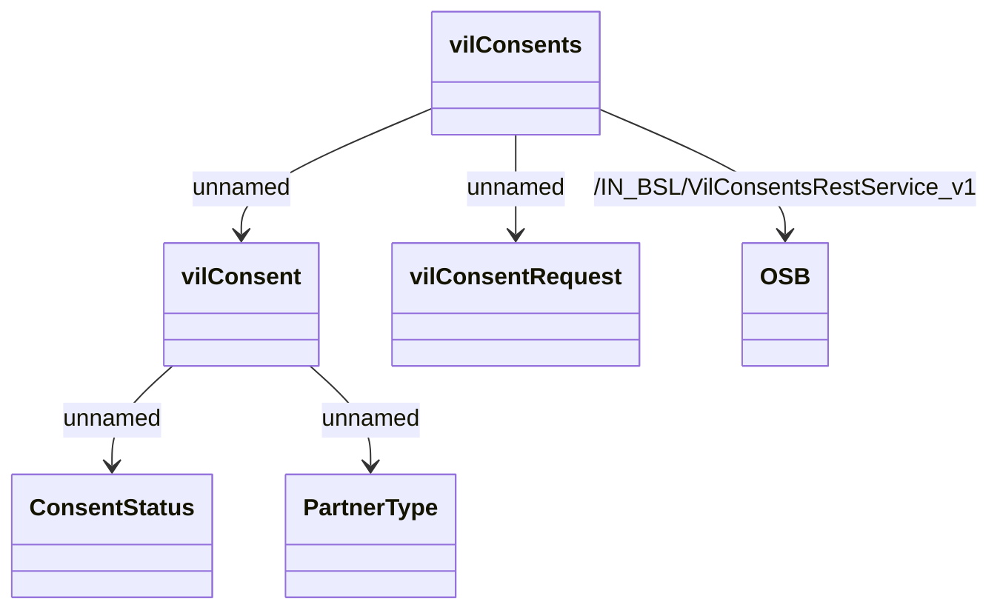

# VIL consent

```mermaid
classDiagram
    class PartnerType["PartnerType"]
    class ConsentStatus["ConsentStatus"]
    class vilConsent["vilConsent"]
    class vilConsentRequest["vilConsentRequest"]
    class vilConsents["vilConsents"]
    class OSB["OSB"]
    vilConsents --> OSB : /IN_BSL/VilConsentsRestService_v1
    vilConsents --> vilConsentRequest : unnamed
    vilConsents --> vilConsent : unnamed
    vilConsent --> ConsentStatus : unnamed
    vilConsent --> PartnerType : unnamed
```
