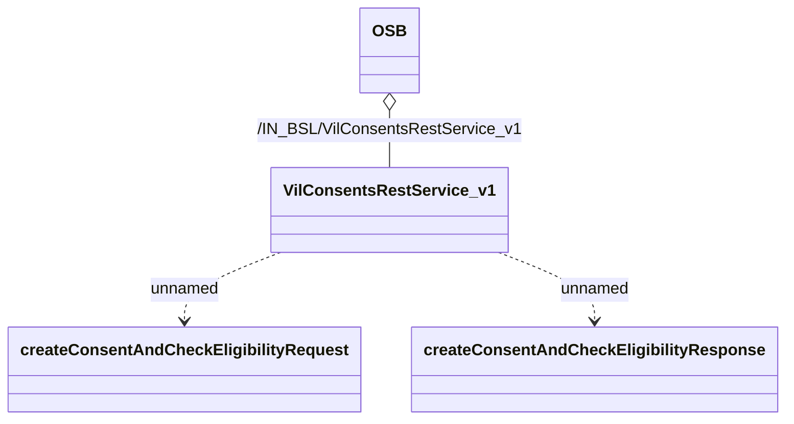

# Vodafone/Idea limited

- **Diagram Type**: Logical
- **Package**: HomerSelect/BSL/Analysis Model/_Interface/Consumed services/Vodafone/idea limited
- **Diagram ID**: 131155
- **Elements**: 4
- **Connectors**: 3

