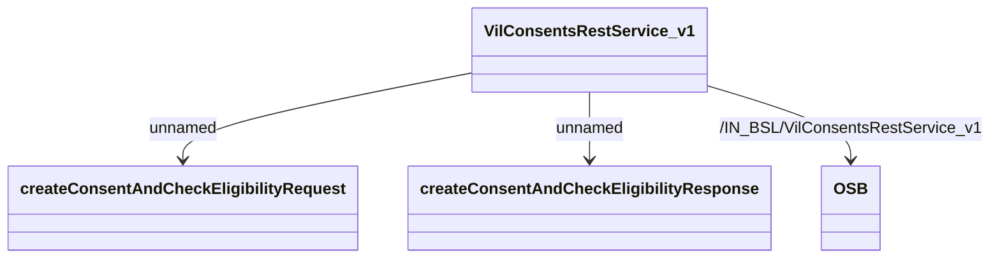

# Vodafone/Idea limited

```mermaid
classDiagram
    class VilConsentsRestService_v1["VilConsentsRestService_v1"]
    class OSB["OSB"]
    class createConsentAndCheckEligibilityResponse["createConsentAndCheckEligibilityResponse"]
    class createConsentAndCheckEligibilityRequest["createConsentAndCheckEligibilityRequest"]
    VilConsentsRestService_v1 --> createConsentAndCheckEligibilityRequest : unnamed
    VilConsentsRestService_v1 --> createConsentAndCheckEligibilityResponse : unnamed
    VilConsentsRestService_v1 --> OSB : /IN_BSL/VilConsentsRestService_v1
```
