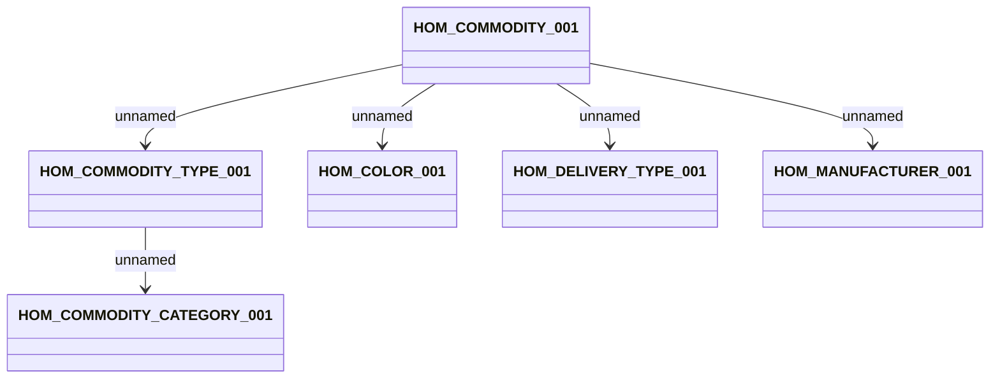

# Commodity (DWH Interface)

```mermaid
classDiagram
    class HOM_COMMODITY_CATEGORY_001["HOM_COMMODITY_CATEGORY_001"]
    class HOM_COMMODITY_TYPE_001["HOM_COMMODITY_TYPE_001"]
    class HOM_COMMODITY_001["HOM_COMMODITY_001"]
    class HOM_COLOR_001["HOM_COLOR_001"]
    class HOM_DELIVERY_TYPE_001["HOM_DELIVERY_TYPE_001"]
    class HOM_MANUFACTURER_001["HOM_MANUFACTURER_001"]
    HOM_COMMODITY_TYPE_001 --> HOM_COMMODITY_CATEGORY_001 : unnamed
    HOM_COMMODITY_001 --> HOM_COMMODITY_TYPE_001 : unnamed
    HOM_COMMODITY_001 --> HOM_COLOR_001 : unnamed
    HOM_COMMODITY_001 --> HOM_DELIVERY_TYPE_001 : unnamed
    HOM_COMMODITY_001 --> HOM_MANUFACTURER_001 : unnamed
```
