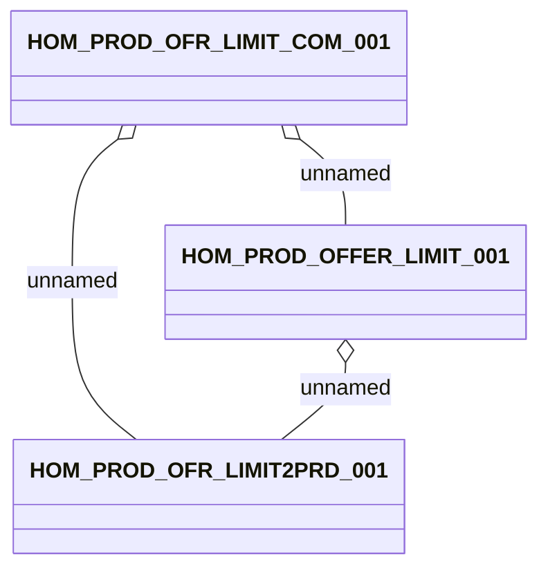

# Product Offer Limit (DWH Interface)

- **Diagram Type**: Logical
- **Package**: HomerSelect/BSL/Analysis Model/_Interface/DWH tables/PCG/Marketing Offer
- **Diagram ID**: 94000
- **Elements**: 3
- **Connectors**: 3

