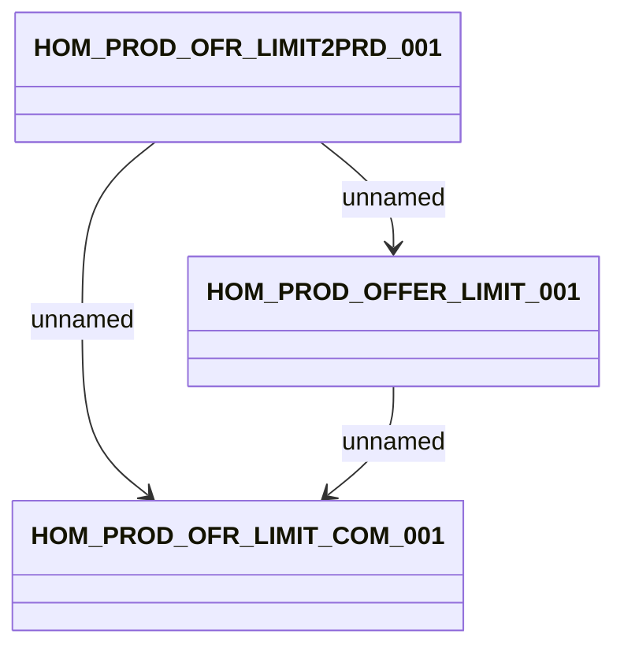

# Product Offer Limit (DWH Interface)

```mermaid
classDiagram
    class HOM_PROD_OFR_LIMIT2PRD_001["HOM_PROD_OFR_LIMIT2PRD_001"]
    class HOM_PROD_OFFER_LIMIT_001["HOM_PROD_OFFER_LIMIT_001"]
    class HOM_PROD_OFR_LIMIT_COM_001["HOM_PROD_OFR_LIMIT_COM_001"]
    HOM_PROD_OFR_LIMIT2PRD_001 --> HOM_PROD_OFR_LIMIT_COM_001 : unnamed
    HOM_PROD_OFFER_LIMIT_001 --> HOM_PROD_OFR_LIMIT_COM_001 : unnamed
    HOM_PROD_OFR_LIMIT2PRD_001 --> HOM_PROD_OFFER_LIMIT_001 : unnamed
```
