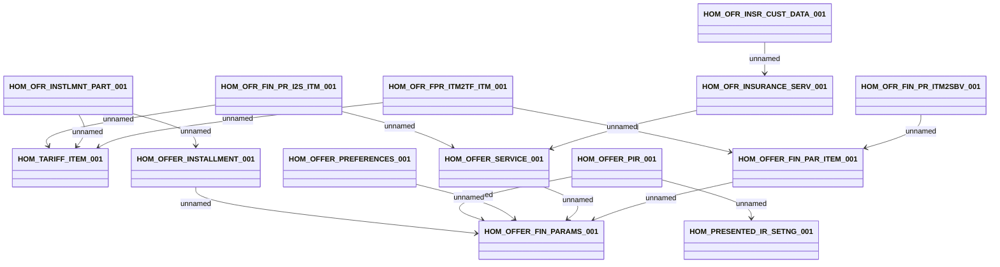

# Offer Financial Parameters (DWH Interface)

```mermaid
classDiagram
    class HOM_TARIFF_ITEM_001["HOM_TARIFF_ITEM_001"]
    class HOM_PRESENTED_IR_SETNG_001["HOM_PRESENTED_IR_SETNG_001"]
    class HOM_OFR_INSURANCE_SERV_001["HOM_OFR_INSURANCE_SERV_001"]
    class HOM_OFR_INSTLMNT_PART_001["HOM_OFR_INSTLMNT_PART_001"]
    class HOM_OFR_INSR_CUST_DATA_001["HOM_OFR_INSR_CUST_DATA_001"]
    class HOM_OFR_FPR_ITM2TF_ITM_001["HOM_OFR_FPR_ITM2TF_ITM_001"]
    class HOM_OFR_FIN_PR_ITM2SBV_001["HOM_OFR_FIN_PR_ITM2SBV_001"]
    class HOM_OFR_FIN_PR_I2S_ITM_001["HOM_OFR_FIN_PR_I2S_ITM_001"]
    class HOM_OFFER_SERVICE_001["HOM_OFFER_SERVICE_001"]
    class HOM_OFFER_PREFERENCES_001["HOM_OFFER_PREFERENCES_001"]
    class HOM_OFFER_PIR_001["HOM_OFFER_PIR_001"]
    class HOM_OFFER_INSTALLMENT_001["HOM_OFFER_INSTALLMENT_001"]
    class HOM_OFFER_FIN_PAR_ITEM_001["HOM_OFFER_FIN_PAR_ITEM_001"]
    class HOM_OFFER_FIN_PARAMS_001["HOM_OFFER_FIN_PARAMS_001"]
    HOM_OFFER_INSTALLMENT_001 --> HOM_OFFER_FIN_PARAMS_001 : unnamed
    HOM_OFFER_PIR_001 --> HOM_OFFER_FIN_PARAMS_001 : unnamed
    HOM_OFFER_PREFERENCES_001 --> HOM_OFFER_FIN_PARAMS_001 : unnamed
    HOM_OFFER_SERVICE_001 --> HOM_OFFER_FIN_PARAMS_001 : unnamed
    HOM_OFFER_FIN_PAR_ITEM_001 --> HOM_OFFER_FIN_PARAMS_001 : unnamed
    HOM_OFR_FPR_ITM2TF_ITM_001 --> HOM_OFFER_FIN_PAR_ITEM_001 : unnamed
    HOM_OFR_FIN_PR_ITM2SBV_001 --> HOM_OFFER_FIN_PAR_ITEM_001 : unnamed
    HOM_OFR_INSTLMNT_PART_001 --> HOM_OFFER_INSTALLMENT_001 : unnamed
    HOM_OFR_FIN_PR_I2S_ITM_001 --> HOM_OFFER_SERVICE_001 : unnamed
    HOM_OFR_INSURANCE_SERV_001 --> HOM_OFFER_SERVICE_001 : unnamed
    HOM_OFR_INSR_CUST_DATA_001 --> HOM_OFR_INSURANCE_SERV_001 : unnamed
    HOM_OFFER_PIR_001 --> HOM_PRESENTED_IR_SETNG_001 : unnamed
    HOM_OFR_FIN_PR_I2S_ITM_001 --> HOM_TARIFF_ITEM_001 : unnamed
    HOM_OFR_INSTLMNT_PART_001 --> HOM_TARIFF_ITEM_001 : unnamed
    HOM_OFR_FPR_ITM2TF_ITM_001 --> HOM_TARIFF_ITEM_001 : unnamed
```
