# Product (DWH Interface)

- **Diagram Type**: Logical
- **Package**: HomerSelect/BSL/Analysis Model/_Interface/DWH tables/PCG/Product Catalogue
- **Diagram ID**: 113508
- **Elements**: 23
- **Connectors**: 22

```mermaid
classDiagram
    class HOM_PRODUCT_TYPE_001["HOM_PRODUCT_TYPE_001"]
    class HOM_PRODUCT_SET_001["HOM_PRODUCT_SET_001"]
    class HOM_MARKETING_ACTION_001["HOM_MARKETING_ACTION_001"]
    class HOM_TERMS_AND_COND_001["HOM_TERMS_AND_COND_001"]
    class Product_Catalogue_Tariff_DWH_Interface["Product Catalogue :Tariff (DWH Interface)"]
    class HOM_TARIFF_001["HOM_TARIFF_001"]
    class HOM_CLSD_END_LN_VAR_TR_001["HOM_CLSD_END_LN_VAR_TR_001"]
    class HOM_CLSD_END_LN_VAR_AN_001["HOM_CLSD_END_LN_VAR_AN_001"]
    class HOM_REVOLV_LOAN_VAR_001["HOM_REVOLV_LOAN_VAR_001"]
    class HOM_CLSD_END_LN_VAR_001["HOM_CLSD_END_LN_VAR_001"]
    class HOM_PRODUCT_VARIANT_001["HOM_PRODUCT_VARIANT_001"]
    class HOM_SUBVENTION_001["HOM_SUBVENTION_001"]
    class HOM_COL_PROD2MANUFACT_001["HOM_COL_PROD2MANUFACT_001"]
    class HOM_PROFILE_INST_SCHED_001["HOM_PROFILE_INST_SCHED_001"]
    class HOM_PRODUCT2SERVICE_TP_001["HOM_PRODUCT2SERVICE_TP_001"]
    class HOM_PRODUCT2SERVICE_001["HOM_PRODUCT2SERVICE_001"]
    class HOM_PRODUCT2SALES_AREA_001["HOM_PRODUCT2SALES_AREA_001"]
    class HOM_PROFILE2PROD_SET_001["HOM_PROFILE2PROD_SET_001"]
    class HOM_PROD_DOC_PRINTOUT_001["HOM_PROD_DOC_PRINTOUT_001"]
    class HOM_PRODUCT_PROFILE_001["HOM_PRODUCT_PROFILE_001"]
    class HOM_PROD2MARKETNG_ACTN_001["HOM_PROD2MARKETNG_ACTN_001"]
    class HOM_PROD2COMMODITY_TP_001["HOM_PROD2COMMODITY_TP_001"]
    class HOM_PRODUCT_001["HOM_PRODUCT_001"]
    HOM_PRODUCT_001 o-- HOM_PRODUCT2SALES_AREA_001 : unnamed
    HOM_CLSD_END_LN_VAR_001 o-- HOM_CLSD_END_LN_VAR_TR_001 : unnamed
    HOM_CLSD_END_LN_VAR_001 o-- HOM_CLSD_END_LN_VAR_AN_001 : unnamed
    HOM_PRODUCT_VARIANT_001 <|-- HOM_REVOLV_LOAN_VAR_001 : unnamed
    HOM_PRODUCT_VARIANT_001 <|-- HOM_CLSD_END_LN_VAR_001 : unnamed
    HOM_PRODUCT_001 o-- HOM_PRODUCT_VARIANT_001 : unnamed
    HOM_PRODUCT_001 o-- HOM_SUBVENTION_001 : unnamed
    HOM_PRODUCT_001 o-- HOM_COL_PROD2MANUFACT_001 : unnamed
    HOM_PRODUCT_PROFILE_001 o-- HOM_PROFILE_INST_SCHED_001 : unnamed
    Product_Catalogue_Tariff_DWH_Interface --> HOM_TARIFF_001 : unnamed
    HOM_PRODUCT_001 o-- HOM_PRODUCT2SERVICE_001 : unnamed
    HOM_PRODUCT_001 ..> HOM_PRODUCT_PROFILE_001 : unnamed
    HOM_PROFILE2PROD_SET_001 ..> HOM_PRODUCT_SET_001 : unnamed
    HOM_PRODUCT_PROFILE_001 o-- HOM_PROFILE2PROD_SET_001 : unnamed
    HOM_PRODUCT_001 o-- HOM_PROD_DOC_PRINTOUT_001 : unnamed
    HOM_PRODUCT_PROFILE_001 ..> HOM_PRODUCT_TYPE_001 : unnamed
    HOM_PROD2MARKETNG_ACTN_001 ..> HOM_MARKETING_ACTION_001 : unnamed
    HOM_PRODUCT_001 o-- HOM_PROD2MARKETNG_ACTN_001 : unnamed
    HOM_PRODUCT_001 o-- HOM_PROD2COMMODITY_TP_001 : unnamed
    HOM_PRODUCT_001 ..> HOM_TARIFF_001 : unnamed
    HOM_PRODUCT_001 ..> HOM_TERMS_AND_COND_001 : unnamed
    HOM_PRODUCT_001 o-- HOM_PRODUCT2SERVICE_TP_001 : unnamed
```

