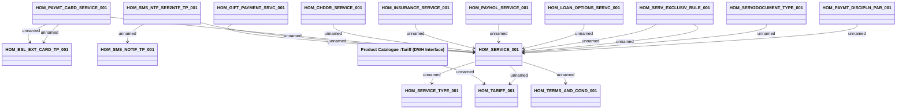

# Service (DWH Interface)

```mermaid
classDiagram
    class HOM_TERMS_AND_COND_001["HOM_TERMS_AND_COND_001"]
    class HOM_BSL_EXT_CARD_TP_001["HOM_BSL_EXT_CARD_TP_001"]
    class HOM_SMS_NOTIF_TP_001["HOM_SMS_NOTIF_TP_001"]
    class HOM_INSURANCE_SERVICE_001["HOM_INSURANCE_SERVICE_001"]
    class HOM_SMS_NTF_SER2NTF_TP_001["HOM_SMS_NTF_SER2NTF_TP_001"]
    class HOM_PAYMT_CARD_SERVICE_001["HOM_PAYMT_CARD_SERVICE_001"]
    class HOM_CHDDR_SERVICE_001["HOM_CHDDR_SERVICE_001"]
    class HOM_PAYMT_DISCIPLN_PAR_001["HOM_PAYMT_DISCIPLN_PAR_001"]
    class HOM_PAYHOL_SERVICE_001["HOM_PAYHOL_SERVICE_001"]
    class HOM_GIFT_PAYMENT_SRVC_001["HOM_GIFT_PAYMENT_SRVC_001"]
    class Product_Catalogue_Tariff_DWH_Interface["Product Catalogue :Tariff (DWH Interface)"]
    class HOM_TARIFF_001["HOM_TARIFF_001"]
    class HOM_LOAN_OPTIONS_SERVC_001["HOM_LOAN_OPTIONS_SERVC_001"]
    class HOM_SERVICE_TYPE_001["HOM_SERVICE_TYPE_001"]
    class HOM_SERV_EXCLUSIV_RULE_001["HOM_SERV_EXCLUSIV_RULE_001"]
    class HOM_SERV2DOCUMENT_TYPE_001["HOM_SERV2DOCUMENT_TYPE_001"]
    class HOM_SERVICE_001["HOM_SERVICE_001"]
    HOM_GIFT_PAYMENT_SRVC_001 --> HOM_SERVICE_001 : unnamed
    HOM_SMS_NTF_SER2NTF_TP_001 --> HOM_SERVICE_001 : unnamed
    HOM_SMS_NTF_SER2NTF_TP_001 --> HOM_SMS_NOTIF_TP_001 : unnamed
    HOM_PAYMT_CARD_SERVICE_001 --> HOM_SERVICE_001 : unnamed
    HOM_PAYMT_CARD_SERVICE_001 --> HOM_BSL_EXT_CARD_TP_001 : unnamed
    HOM_PAYMT_CARD_SERVICE_001 --> HOM_BSL_EXT_CARD_TP_001 : unnamed
    HOM_CHDDR_SERVICE_001 --> HOM_SERVICE_001 : unnamed
    HOM_INSURANCE_SERVICE_001 --> HOM_SERVICE_001 : unnamed
    HOM_PAYHOL_SERVICE_001 --> HOM_SERVICE_001 : unnamed
    HOM_SERVICE_001 --> HOM_SERVICE_TYPE_001 : unnamed
    Product_Catalogue_Tariff_DWH_Interface --> HOM_TARIFF_001 : unnamed
    HOM_LOAN_OPTIONS_SERVC_001 --> HOM_SERVICE_001 : unnamed
    HOM_SERV_EXCLUSIV_RULE_001 --> HOM_SERVICE_001 : unnamed
    HOM_SERV_EXCLUSIV_RULE_001 --> HOM_SERVICE_001 : unnamed
    HOM_SERV2DOCUMENT_TYPE_001 --> HOM_SERVICE_001 : unnamed
    HOM_SERVICE_001 --> HOM_TARIFF_001 : unnamed
    HOM_SERVICE_001 --> HOM_TERMS_AND_COND_001 : unnamed
    HOM_PAYMT_DISCIPLN_PAR_001 --> HOM_SERVICE_001 : unnamed
```
