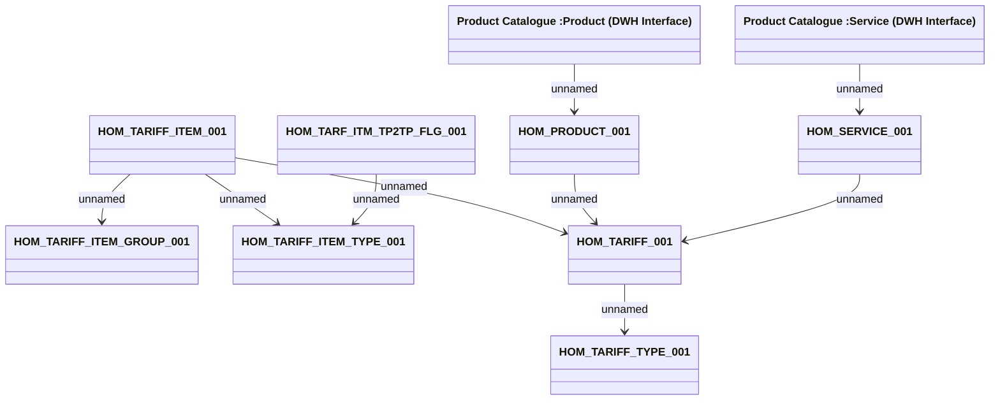

# Tariff (DWH Interface)

```mermaid
classDiagram
    class HOM_TARIFF_ITEM_GROUP_001["HOM_TARIFF_ITEM_GROUP_001"]
    class HOM_TARIFF_TYPE_001["HOM_TARIFF_TYPE_001"]
    class HOM_SERVICE_001["HOM_SERVICE_001"]
    class HOM_PRODUCT_001["HOM_PRODUCT_001"]
    class Product_Catalogue_Service_DWH_Interface["Product Catalogue :Service (DWH Interface)"]
    class Product_Catalogue_Product_DWH_Interface["Product Catalogue :Product (DWH Interface)"]
    class HOM_TARIFF_ITEM_TYPE_001["HOM_TARIFF_ITEM_TYPE_001"]
    class HOM_TARF_ITM_TP2TP_FLG_001["HOM_TARF_ITM_TP2TP_FLG_001"]
    class HOM_TARIFF_ITEM_001["HOM_TARIFF_ITEM_001"]
    class HOM_TARIFF_001["HOM_TARIFF_001"]
    HOM_TARIFF_001 --> HOM_TARIFF_TYPE_001 : unnamed
    HOM_TARIFF_ITEM_001 --> HOM_TARIFF_001 : unnamed
    HOM_TARIFF_ITEM_001 --> HOM_TARIFF_ITEM_TYPE_001 : unnamed
    HOM_TARIFF_ITEM_001 --> HOM_TARIFF_ITEM_GROUP_001 : unnamed
    HOM_TARF_ITM_TP2TP_FLG_001 --> HOM_TARIFF_ITEM_TYPE_001 : unnamed
    Product_Catalogue_Product_DWH_Interface --> HOM_PRODUCT_001 : unnamed
    Product_Catalogue_Service_DWH_Interface --> HOM_SERVICE_001 : unnamed
    HOM_PRODUCT_001 --> HOM_TARIFF_001 : unnamed
    HOM_SERVICE_001 --> HOM_TARIFF_001 : unnamed
```
