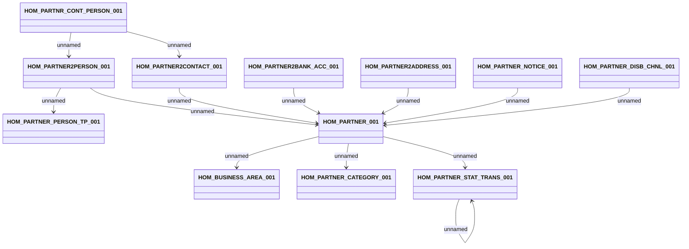

# Partner (DWH Interface)

```mermaid
classDiagram
    class HOM_BUSINESS_AREA_001["HOM_BUSINESS_AREA_001"]
    class HOM_PARTNER_CATEGORY_001["HOM_PARTNER_CATEGORY_001"]
    class HOM_PARTNER_PERSON_TP_001["HOM_PARTNER_PERSON_TP_001"]
    class HOM_PARTNR_CONT_PERSON_001["HOM_PARTNR_CONT_PERSON_001"]
    class HOM_PARTNER2PERSON_001["HOM_PARTNER2PERSON_001"]
    class HOM_PARTNER2CONTACT_001["HOM_PARTNER2CONTACT_001"]
    class HOM_PARTNER2BANK_ACC_001["HOM_PARTNER2BANK_ACC_001"]
    class HOM_PARTNER2ADDRESS_001["HOM_PARTNER2ADDRESS_001"]
    class HOM_PARTNER_STAT_TRANS_001["HOM_PARTNER_STAT_TRANS_001"]
    class HOM_PARTNER_NOTICE_001["HOM_PARTNER_NOTICE_001"]
    class HOM_PARTNER_DISB_CHNL_001["HOM_PARTNER_DISB_CHNL_001"]
    class HOM_PARTNER_001["HOM_PARTNER_001"]
    HOM_PARTNER_001 --> HOM_BUSINESS_AREA_001 : unnamed
    HOM_PARTNER_001 --> HOM_PARTNER_CATEGORY_001 : unnamed
    HOM_PARTNER2PERSON_001 --> HOM_PARTNER_PERSON_TP_001 : unnamed
    HOM_PARTNER2PERSON_001 --> HOM_PARTNER_001 : unnamed
    HOM_PARTNER2CONTACT_001 --> HOM_PARTNER_001 : unnamed
    HOM_PARTNER2BANK_ACC_001 --> HOM_PARTNER_001 : unnamed
    HOM_PARTNER2ADDRESS_001 --> HOM_PARTNER_001 : unnamed
    HOM_PARTNER_NOTICE_001 --> HOM_PARTNER_001 : unnamed
    HOM_PARTNER_DISB_CHNL_001 --> HOM_PARTNER_001 : unnamed
    HOM_PARTNER_STAT_TRANS_001 --> HOM_PARTNER_STAT_TRANS_001 : unnamed
    HOM_PARTNER_001 --> HOM_PARTNER_STAT_TRANS_001 : unnamed
    HOM_PARTNR_CONT_PERSON_001 --> HOM_PARTNER2CONTACT_001 : unnamed
    HOM_PARTNR_CONT_PERSON_001 --> HOM_PARTNER2PERSON_001 : unnamed
```
