# Salesroom (DWH Interface)

- **Diagram Type**: Logical
- **Package**: HomerSelect/BSL/Analysis Model/_Interface/DWH tables/PCG/Sales Network Management
- **Diagram ID**: 93308
- **Elements**: 16
- **Connectors**: 17

```mermaid
classDiagram
    class HOM_SALRM_PERSON_TYPE_001["HOM_SALRM_PERSON_TYPE_001"]
    class HOM_SALRM_BUSINESS_MDL_001["HOM_SALRM_BUSINESS_MDL_001"]
    class HOM_SALESROOM_CATEGORY_001["HOM_SALESROOM_CATEGORY_001"]
    class HOM_SALRM2USER_DETAIL_001["HOM_SALRM2USER_DETAIL_001"]
    class HOM_SALRM2COMMOD_TYPE_001["HOM_SALRM2COMMOD_TYPE_001"]
    class HOM_SALESROOM2PRODUCT_001["HOM_SALESROOM2PRODUCT_001"]
    class HOM_SALRM2BANK_ACCOUNT_001["HOM_SALRM2BANK_ACCOUNT_001"]
    class HOM_SALRM_STATUS_TRANS_001["HOM_SALRM_STATUS_TRANS_001"]
    class HOM_SALRM_DISB_CHAN_001["HOM_SALRM_DISB_CHAN_001"]
    class HOM_SALRM_CONT_PERSON_001["HOM_SALRM_CONT_PERSON_001"]
    class HOM_SALESROOM2PERSON_001["HOM_SALESROOM2PERSON_001"]
    class HOM_SALESROOM2CONTACT_001["HOM_SALESROOM2CONTACT_001"]
    class HOM_SALESROOM2ADDRESS_001["HOM_SALESROOM2ADDRESS_001"]
    class HOM_SALESROOM_NOTICE_001["HOM_SALESROOM_NOTICE_001"]
    class HOM_SALESMAN_001["HOM_SALESMAN_001"]
    class HOM_SALESROOM_001["HOM_SALESROOM_001"]
    HOM_SALESROOM_001 o-- HOM_SALRM2USER_DETAIL_001 : unnamed
    HOM_SALESROOM2PERSON_001 o-- HOM_SALRM_CONT_PERSON_001 : unnamed
    HOM_SALESROOM2CONTACT_001 o-- HOM_SALRM_CONT_PERSON_001 : unnamed
    HOM_SALESROOM_001 ..> HOM_SALRM_BUSINESS_MDL_001 : unnamed
    HOM_SALESROOM2PERSON_001 ..> HOM_SALRM_PERSON_TYPE_001 : unnamed
    HOM_SALESROOM_001 o-- HOM_SALESMAN_001 : unnamed
    HOM_SALESROOM_001 o-- HOM_SALESROOM_NOTICE_001 : unnamed
    HOM_SALRM_STATUS_TRANS_001 --> HOM_SALRM_STATUS_TRANS_001 : unnamed
    HOM_SALESROOM_001 o-- HOM_SALESROOM2CONTACT_001 : unnamed
    HOM_SALESROOM_001 ..> HOM_SALESROOM_CATEGORY_001 : unnamed
    HOM_SALESROOM_001 o-- HOM_SALRM_DISB_CHAN_001 : unnamed
    HOM_SALRM_STATUS_TRANS_001 --> HOM_SALESROOM_001 : unnamed
    HOM_SALESROOM_001 o-- HOM_SALRM2BANK_ACCOUNT_001 : unnamed
    HOM_SALESROOM_001 o-- HOM_SALESROOM2PRODUCT_001 : unnamed
    HOM_SALESROOM_001 o-- HOM_SALRM2COMMOD_TYPE_001 : unnamed
    HOM_SALESROOM_001 o-- HOM_SALESROOM2PERSON_001 : unnamed
    HOM_SALESROOM_001 o-- HOM_SALESROOM2ADDRESS_001 : unnamed
```

