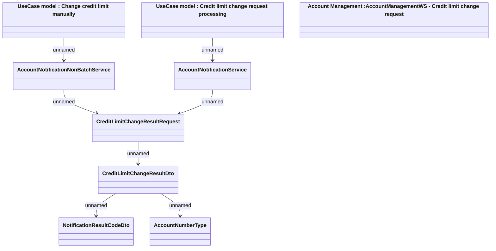

# Consumed messages - Credit limit change

```mermaid
classDiagram
    class UseCase_model_Change_credit_limit_manually["UseCase model : Change credit limit manually"]
    class AccountNotificationNonBatchService["AccountNotificationNonBatchService"]
    class AccountNotificationService["AccountNotificationService"]
    class UseCase_model_Credit_limit_change_request_processing["UseCase model : Credit limit change request processing"]
    class Account_Management_AccountManagementWS_Credit_limit_change_r["Account Management :AccountManagementWS - Credit limit change request"]
    class AccountNumberType["AccountNumberType"]
    class CreditLimitChangeResultDto["CreditLimitChangeResultDto"]
    class NotificationResultCodeDto["NotificationResultCodeDto"]
    class CreditLimitChangeResultRequest["CreditLimitChangeResultRequest"]
    AccountNotificationNonBatchService --> CreditLimitChangeResultRequest : unnamed
    AccountNotificationService --> CreditLimitChangeResultRequest : unnamed
    CreditLimitChangeResultDto --> NotificationResultCodeDto : unnamed
    CreditLimitChangeResultRequest --> CreditLimitChangeResultDto : unnamed
    CreditLimitChangeResultDto --> AccountNumberType : unnamed
    UseCase_model_Credit_limit_change_request_processing --> AccountNotificationService : unnamed
    UseCase_model_Change_credit_limit_manually --> AccountNotificationNonBatchService : unnamed
```
