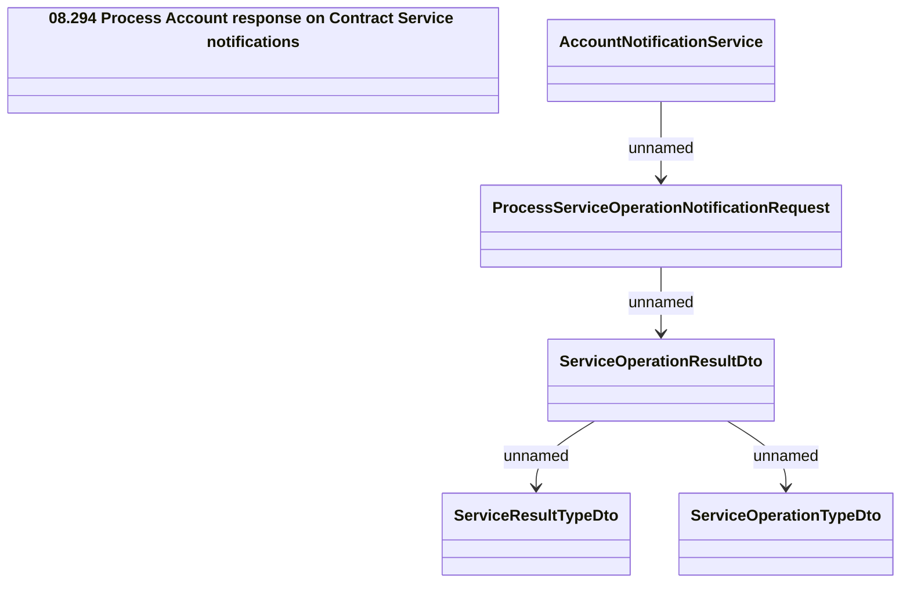

# Consumed messages - Process Service Operation Notification

```mermaid
classDiagram
    class n_08_294_Process_Account_response_on_Contract_Service_notifi["08.294 Process Account response on Contract Service notifications"]
    class ServiceOperationTypeDto["ServiceOperationTypeDto"]
    class ServiceResultTypeDto["ServiceResultTypeDto"]
    class ServiceOperationResultDto["ServiceOperationResultDto"]
    class AccountNotificationService["AccountNotificationService"]
    class ProcessServiceOperationNotificationRequest["ProcessServiceOperationNotificationRequest"]
    AccountNotificationService --> ProcessServiceOperationNotificationRequest : unnamed
    ProcessServiceOperationNotificationRequest --> ServiceOperationResultDto : unnamed
    ServiceOperationResultDto --> ServiceResultTypeDto : unnamed
    ServiceOperationResultDto --> ServiceOperationTypeDto : unnamed
```
