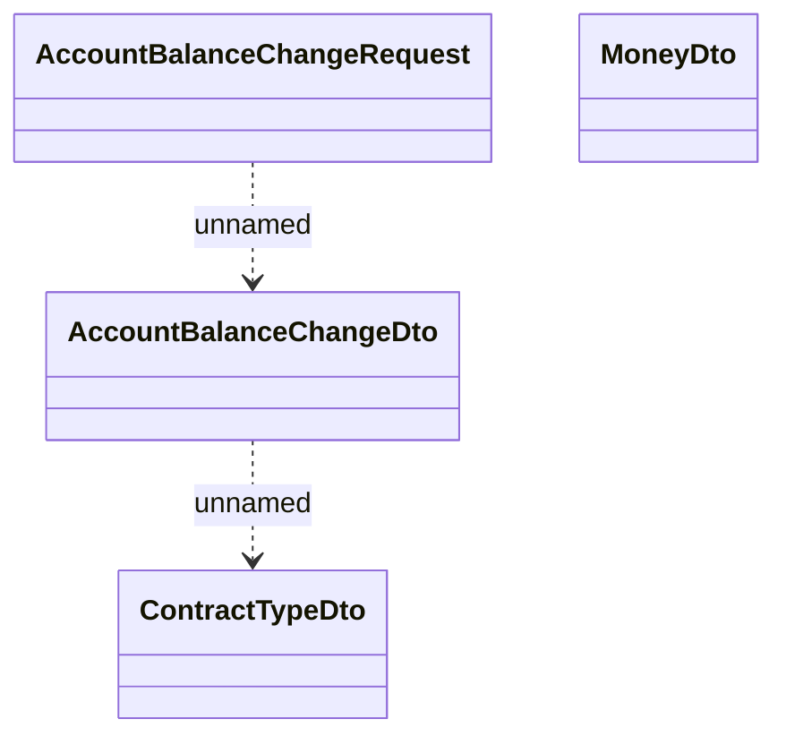

# Consumed messages - REL Account balance change

- **Diagram Type**: Logical
- **Package**: HomerSelect/BSL/Analysis Model/_Interface/JMS messages/Consumed JMS messages/Account Notifications (REL)
- **Diagram ID**: 161746
- **Elements**: 4
- **Connectors**: 2

