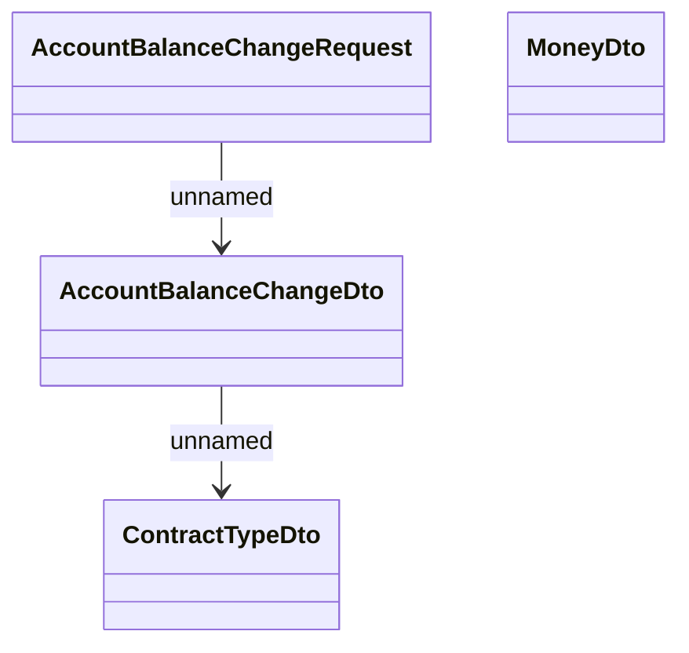

# Consumed messages - REL Account balance change

```mermaid
classDiagram
    class AccountBalanceChangeRequest["AccountBalanceChangeRequest"]
    class ContractTypeDto["ContractTypeDto"]
    class MoneyDto["MoneyDto"]
    class AccountBalanceChangeDto["AccountBalanceChangeDto"]
    AccountBalanceChangeRequest --> AccountBalanceChangeDto : unnamed
    AccountBalanceChangeDto --> ContractTypeDto : unnamed
```
