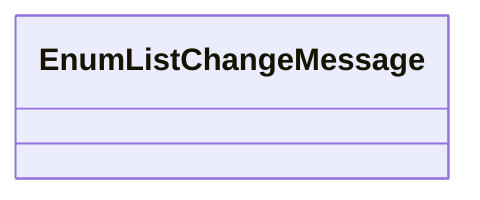

# Codelist notification

- **Diagram Type**: Logical
- **Package**: HomerSelect/BSL/Analysis Model/_Interface/JMS messages/Consumed JMS messages/CSD notification messages/Codelists
- **Diagram ID**: 147854
- **Elements**: 1
- **Connectors**: 0

