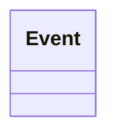

# Contract transition reason

- **Diagram Type**: Logical
- **Package**: HomerSelect/BSL/Analysis Model/_Interface/JMS messages/Consumed JMS messages/CSD notification messages/Contract transition reason
- **Diagram ID**: 153542
- **Elements**: 1
- **Connectors**: 0

