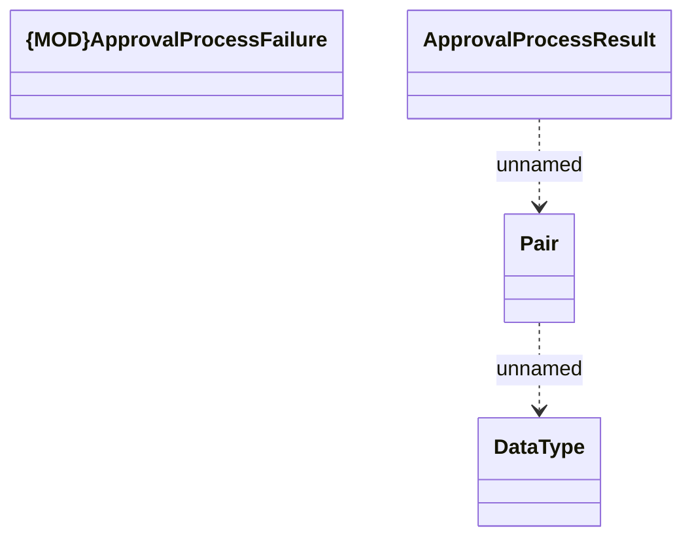

# Consumed JMS messages - ApprovalProcessResultService

- **Diagram Type**: Logical
- **Package**: HomerSelect/BSL/Analysis Model/_Interface/JMS messages/Consumed JMS messages/Contract/Contract approval
- **Diagram ID**: 64378
- **Elements**: 4
- **Connectors**: 2

