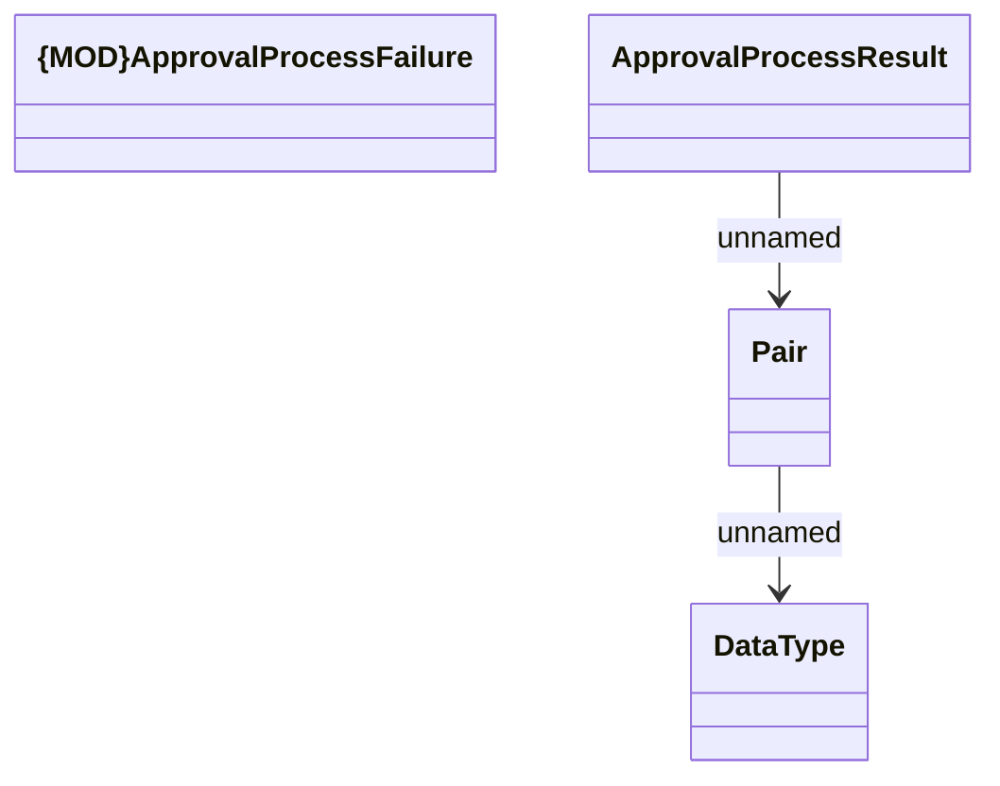

# Consumed JMS messages - ApprovalProcessResultService

```mermaid
classDiagram
    class DataType["DataType"]
    class Pair["Pair"]
    class MOD_ApprovalProcessFailure["{MOD}ApprovalProcessFailure"]
    class ApprovalProcessResult["ApprovalProcessResult"]
    ApprovalProcessResult --> Pair : unnamed
    Pair --> DataType : unnamed
```
