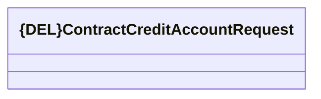

# Consumed JMS messages - Contract credit account request

- **Diagram Type**: Logical
- **Package**: HomerSelect/BSL/Analysis Model/_Interface/JMS messages/Consumed JMS messages/Contract/Contract notifications
- **Diagram ID**: 111033
- **Elements**: 1
- **Connectors**: 0

