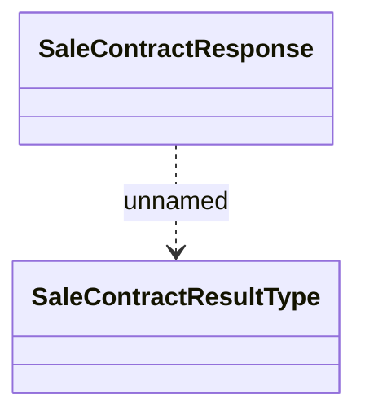

# Consumed JMS messages - Contract sale

- **Diagram Type**: Logical
- **Package**: HomerSelect/BSL/Analysis Model/_Interface/JMS messages/Consumed JMS messages/Contract/Contract sale
- **Diagram ID**: 111034
- **Elements**: 2
- **Connectors**: 1

