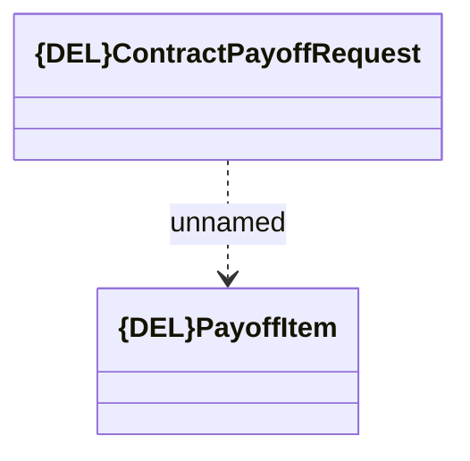

# {DEL}Consumed JMS messages - Contract Pay-Off request

- **Diagram Type**: Logical
- **Package**: HomerSelect/BSL/Analysis Model/_Interface/JMS messages/Consumed JMS messages/Contract/{DEL}Contract Pay-Off request
- **Diagram ID**: 151336
- **Elements**: 2
- **Connectors**: 1

