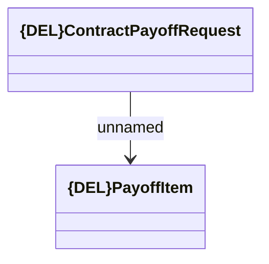

# {DEL}Consumed JMS messages - Contract Pay-Off request

```mermaid
classDiagram
    class DEL_PayoffItem["{DEL}PayoffItem"]
    class DEL_ContractPayoffRequest["{DEL}ContractPayoffRequest"]
    DEL_ContractPayoffRequest --> DEL_PayoffItem : unnamed
```
