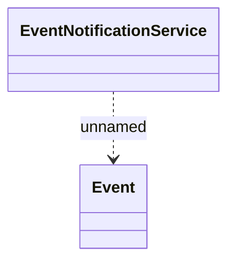

# Data prepared notification

- **Diagram Type**: Logical
- **Package**: HomerSelect/BSL/Analysis Model/_Interface/JMS messages/Consumed JMS messages/Data prepared notification
- **Diagram ID**: 74453
- **Elements**: 2
- **Connectors**: 1

