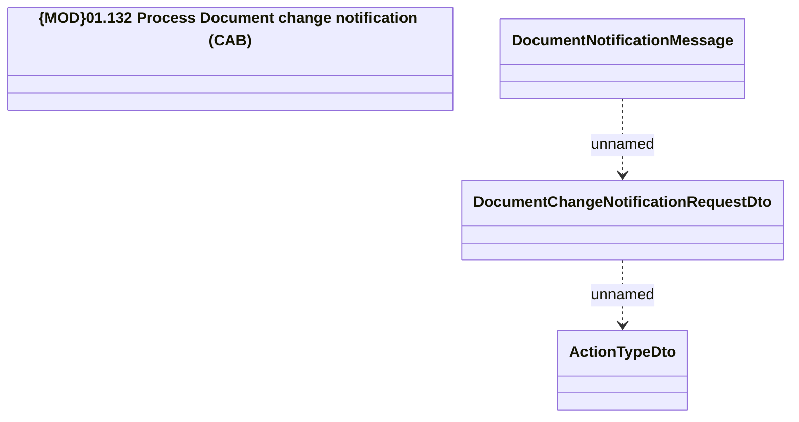

# Document change notification from CAB

- **Diagram Type**: Logical
- **Package**: HomerSelect/BSL/Analysis Model/_Interface/JMS messages/Consumed JMS messages/Document notification
- **Diagram ID**: 132129
- **Elements**: 4
- **Connectors**: 2

