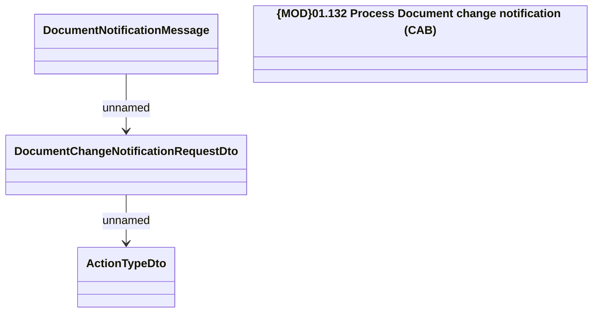

# Document change notification from CAB

```mermaid
classDiagram
    class DocumentNotificationMessage["DocumentNotificationMessage"]
    class ActionTypeDto["ActionTypeDto"]
    class DocumentChangeNotificationRequestDto["DocumentChangeNotificationRequestDto"]
    class MOD_01_132_Process_Document_change_notification_CAB["{MOD}01.132 Process Document change notification (CAB)"]
    DocumentChangeNotificationRequestDto --> ActionTypeDto : unnamed
    DocumentNotificationMessage --> DocumentChangeNotificationRequestDto : unnamed
```
