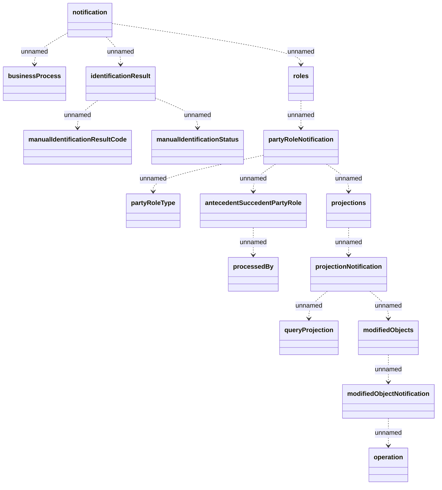

# Party-notification

- **Diagram Type**: Logical
- **Package**: HomerSelect/BSL/Analysis Model/_Interface/JMS messages/Consumed JMS messages/Party notifications
- **Diagram ID**: 82141
- **Elements**: 16
- **Connectors**: 15

