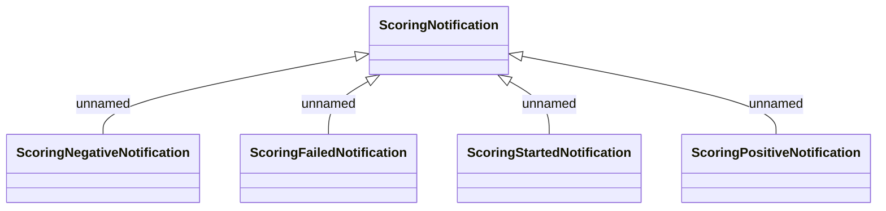

# ScoringNotification v3

- **Diagram Type**: Logical
- **Package**: HomerSelect/BSL/Analysis Model/_Interface/JMS messages/Consumed JMS messages/Scoring notification
- **Diagram ID**: 139566
- **Elements**: 5
- **Connectors**: 4

