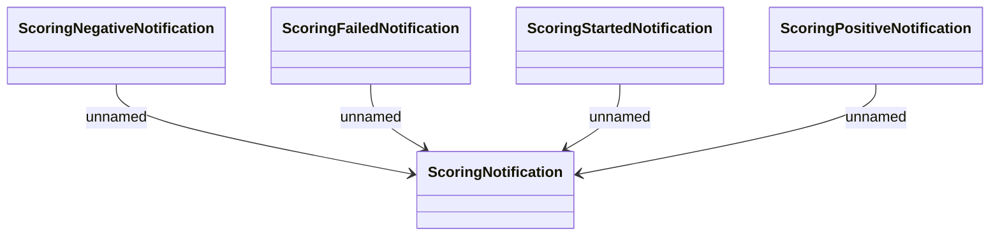

# ScoringNotification v3

```mermaid
classDiagram
    class ScoringNegativeNotification["ScoringNegativeNotification"]
    class ScoringFailedNotification["ScoringFailedNotification"]
    class ScoringStartedNotification["ScoringStartedNotification"]
    class ScoringPositiveNotification["ScoringPositiveNotification"]
    class ScoringNotification["ScoringNotification"]
    ScoringNegativeNotification --> ScoringNotification : unnamed
    ScoringFailedNotification --> ScoringNotification : unnamed
    ScoringStartedNotification --> ScoringNotification : unnamed
    ScoringPositiveNotification --> ScoringNotification : unnamed
```
