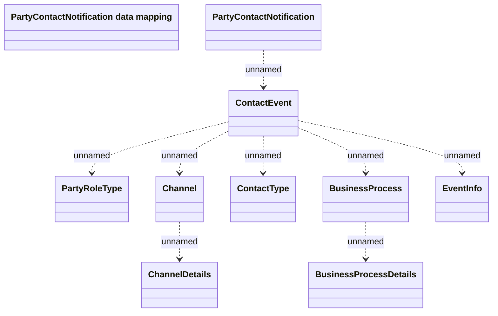

# PartyContactNotification

- **Diagram Type**: Logical
- **Package**: HomerSelect/BSL/Analysis Model/_Interface/JMS messages/Generated JMS messages/Application/PartyContactNotification
- **Diagram ID**: 138521
- **Elements**: 10
- **Connectors**: 8

