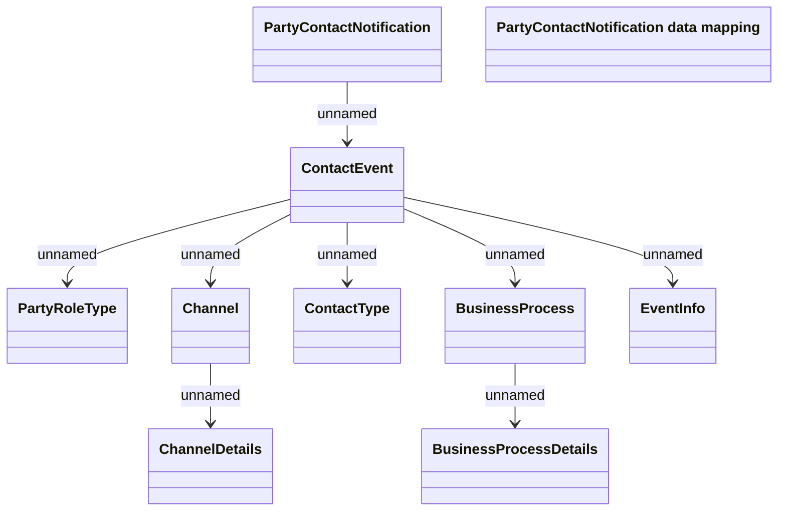

# PartyContactNotification

```mermaid
classDiagram
    class PartyRoleType["PartyRoleType"]
    class PartyContactNotification["PartyContactNotification"]
    class BusinessProcessDetails["BusinessProcessDetails"]
    class ChannelDetails["ChannelDetails"]
    class BusinessProcess["BusinessProcess"]
    class ContactType["ContactType"]
    class Channel["Channel"]
    class ContactEvent["ContactEvent"]
    class EventInfo["EventInfo"]
    class PartyContactNotification_data_mapping["PartyContactNotification data mapping"]
    ContactEvent --> EventInfo : unnamed
    PartyContactNotification --> ContactEvent : unnamed
    ContactEvent --> Channel : unnamed
    ContactEvent --> ContactType : unnamed
    ContactEvent --> BusinessProcess : unnamed
    Channel --> ChannelDetails : unnamed
    BusinessProcess --> BusinessProcessDetails : unnamed
    ContactEvent --> PartyRoleType : unnamed
```
