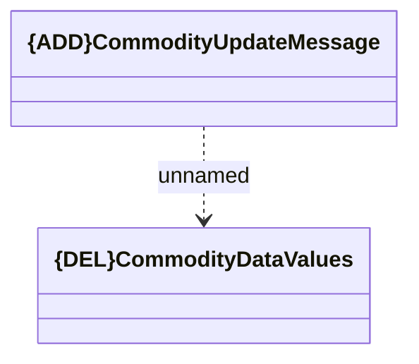

# Generated JMS messages - Commodity Update

- **Diagram Type**: Logical
- **Package**: HomerSelect/BSL/Analysis Model/_Interface/JMS messages/Generated JMS messages/Commodity
- **Diagram ID**: 107836
- **Elements**: 2
- **Connectors**: 1

