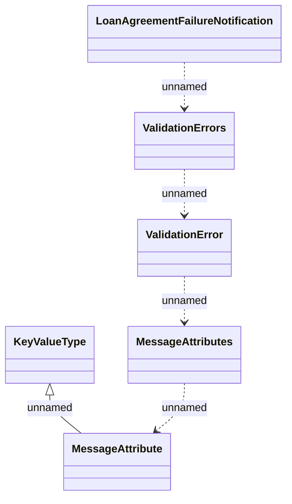

# LoanAgreementFailureNotification - Common

- **Diagram Type**: Logical
- **Package**: HomerSelect/BSL/Analysis Model/_Interface/JMS messages/Generated JMS messages/Loan Agreement/Loan Agreement Notification
- **Diagram ID**: 139144
- **Elements**: 7
- **Connectors**: 5

