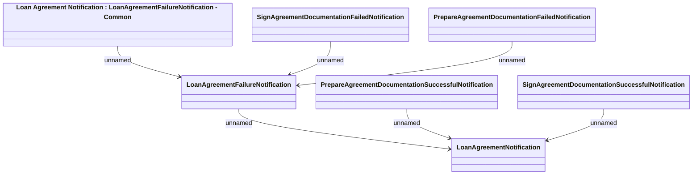

# LoanAgreementNotification

```mermaid
classDiagram
    class Loan_Agreement_Notification_LoanAgreementFailureNotification["Loan Agreement Notification : LoanAgreementFailureNotification - Common"]
    class LoanAgreementFailureNotification["LoanAgreementFailureNotification"]
    class SignAgreementDocumentationFailedNotification["SignAgreementDocumentationFailedNotification"]
    class PrepareAgreementDocumentationFailedNotification["PrepareAgreementDocumentationFailedNotification"]
    class PrepareAgreementDocumentationSuccessfulNotification["PrepareAgreementDocumentationSuccessfulNotification"]
    class SignAgreementDocumentationSuccessfulNotification["SignAgreementDocumentationSuccessfulNotification"]
    class LoanAgreementNotification["LoanAgreementNotification"]
    LoanAgreementFailureNotification --> LoanAgreementNotification : unnamed
    PrepareAgreementDocumentationSuccessfulNotification --> LoanAgreementNotification : unnamed
    SignAgreementDocumentationSuccessfulNotification --> LoanAgreementNotification : unnamed
    Loan_Agreement_Notification_LoanAgreementFailureNotification --> LoanAgreementFailureNotification : unnamed
    SignAgreementDocumentationFailedNotification --> LoanAgreementFailureNotification : unnamed
    PrepareAgreementDocumentationFailedNotification --> LoanAgreementFailureNotification : unnamed
```
