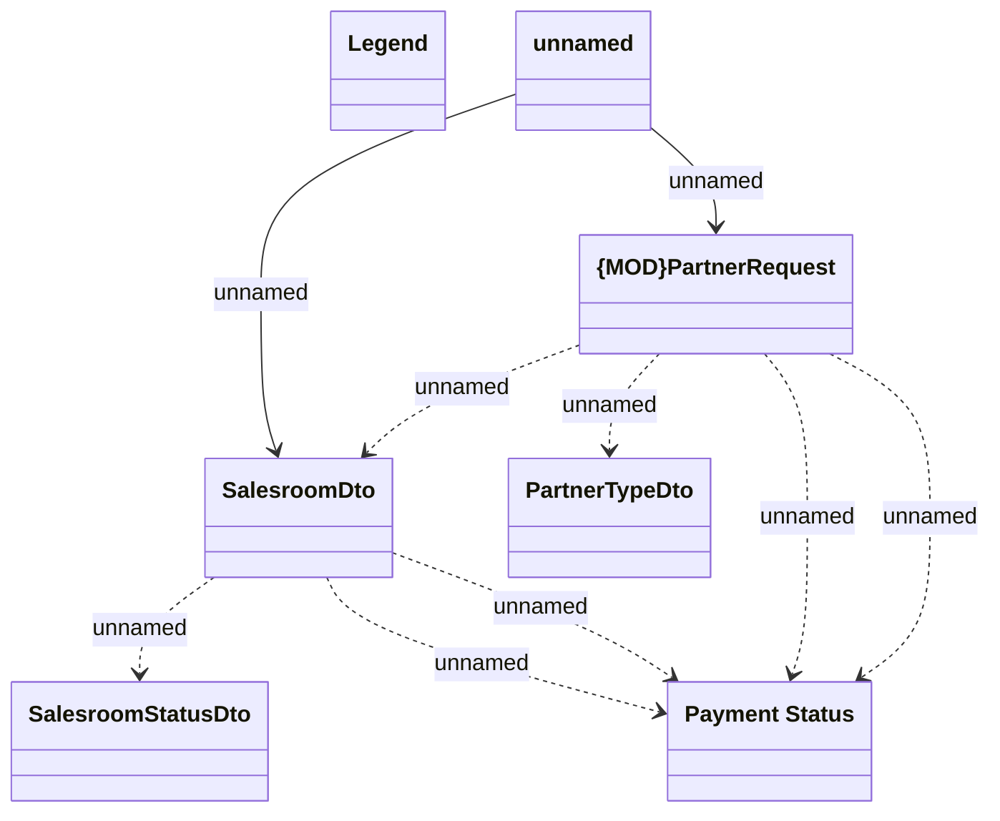

# Generated JMS messages - Sales network

- **Diagram Type**: Logical
- **Package**: HomerSelect/BSL/Analysis Model/_Interface/JMS messages/Generated JMS messages/Sales Network
- **Diagram ID**: 135042
- **Elements**: 7
- **Connectors**: 9

