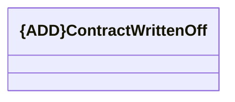

# ContractWrittenOff

- **Diagram Type**: Logical
- **Package**: HomerSelect/BSL/Analysis Model/_Interface/KAFKA messages/Consumed KAFKA messages/COMA/v1.0/ContractWrittenOff/ContractWrittenOff
- **Diagram ID**: 145839
- **Elements**: 1
- **Connectors**: 0

