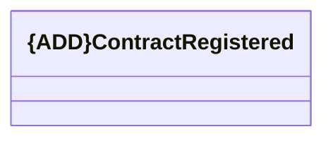

# ContractRegistered

- **Diagram Type**: Logical
- **Package**: HomerSelect/BSL/Analysis Model/_Interface/KAFKA messages/Consumed KAFKA messages/REM/v1.0/ContractRegistrationEvent
- **Diagram ID**: 144986
- **Elements**: 1
- **Connectors**: 0

