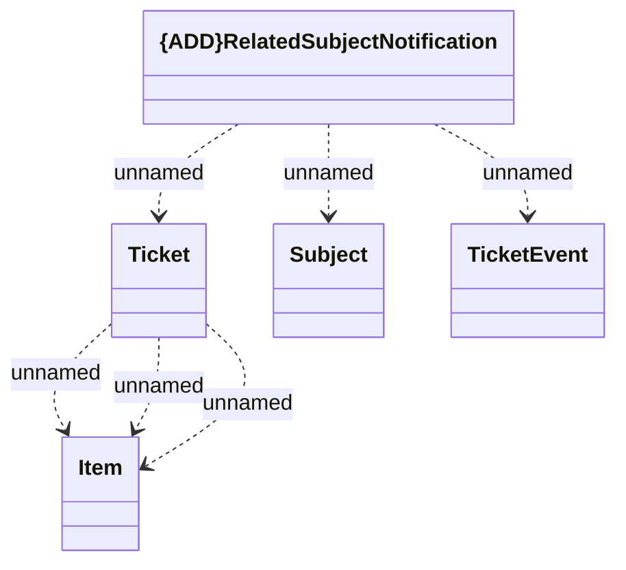

# RelatedSubject

- **Diagram Type**: Logical
- **Package**: HomerSelect/BSL/Analysis Model/_Interface/KAFKA messages/Consumed KAFKA messages/Ticketing/v1.0/RelatedSubject
- **Diagram ID**: 140928
- **Elements**: 5
- **Connectors**: 6

