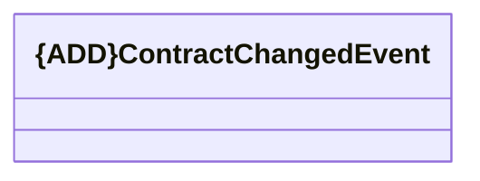

# Common

- **Diagram Type**: Logical
- **Package**: HomerSelect/BSL/Analysis Model/_Interface/KAFKA messages/Generated KAFKA messages/CLM messages/Events/Common
- **Diagram ID**: 145831
- **Elements**: 1
- **Connectors**: 0

