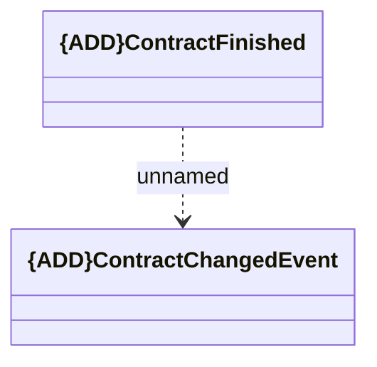

# ContractFinished

- **Diagram Type**: Logical
- **Package**: HomerSelect/BSL/Analysis Model/_Interface/KAFKA messages/Generated KAFKA messages/CLM messages/Events/ContractFinished
- **Diagram ID**: 145833
- **Elements**: 2
- **Connectors**: 1

