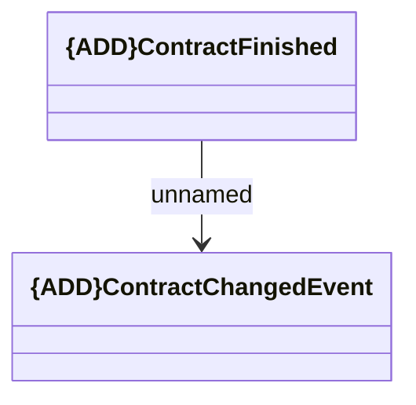

# ContractFinished

```mermaid
classDiagram
    class ADD_ContractChangedEvent["{ADD}ContractChangedEvent"]
    class ADD_ContractFinished["{ADD}ContractFinished"]
    ADD_ContractFinished --> ADD_ContractChangedEvent : unnamed
```
