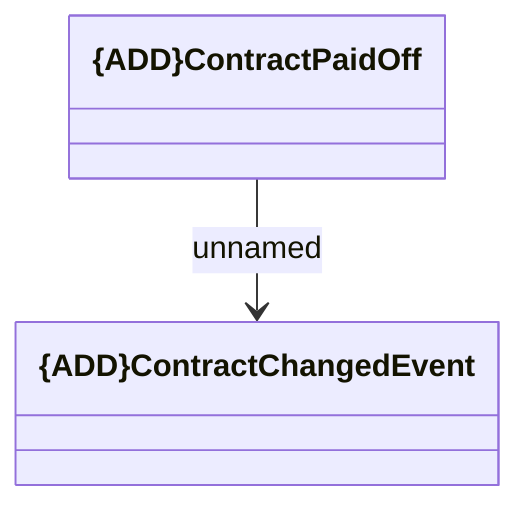

# ContractPaidOff

```mermaid
classDiagram
    class ADD_ContractChangedEvent["{ADD}ContractChangedEvent"]
    class ADD_ContractPaidOff["{ADD}ContractPaidOff"]
    ADD_ContractPaidOff --> ADD_ContractChangedEvent : unnamed
```
