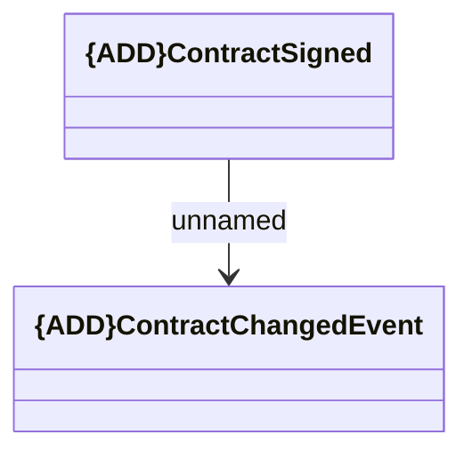

# ContractSigned

```mermaid
classDiagram
    class ADD_ContractChangedEvent["{ADD}ContractChangedEvent"]
    class ADD_ContractSigned["{ADD}ContractSigned"]
    ADD_ContractSigned --> ADD_ContractChangedEvent : unnamed
```
