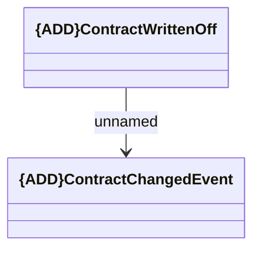

# ContractWrittenOff

```mermaid
classDiagram
    class ADD_ContractChangedEvent["{ADD}ContractChangedEvent"]
    class ADD_ContractWrittenOff["{ADD}ContractWrittenOff"]
    ADD_ContractWrittenOff --> ADD_ContractChangedEvent : unnamed
```
