# Loan Service Requests

- **Diagram Type**: Logical
- **Package**: HomerSelect/BSL/Analysis Model/_Interface/KAFKA messages/Generated KAFKA messages/CSI messages/Loan Service Requests
- **Diagram ID**: 161549
- **Elements**: 18
- **Connectors**: 19

```mermaid
classDiagram
    class RequestOrigination["RequestOrigination"]
    class PerVariantType["PerVariantType"]
    class CetVariantType["CetVariantType"]
    class ConsolidationVariantType["ConsolidationVariantType"]
    class PaymentHolidayRequest["PaymentHolidayRequest"]
    class LoanRestructuringOffer["LoanRestructuringOffer"]
    class LoanRestructuringRequest["LoanRestructuringRequest"]
    class EarlyRepaymentRequest["EarlyRepaymentRequest"]
    class LoanConsolidationRequest["LoanConsolidationRequest"]
    class CheckingTermsRequest["CheckingTermsRequest"]
    class Evaluated_Period_Data["Evaluated Period Data"]
    class CELRewardEvaluatedPeriod["CELRewardEvaluatedPeriod"]
    class CELRewardRequest["CELRewardRequest"]
    class ChangeDueDateRequest["ChangeDueDateRequest"]
    class OperationStatusType["OperationStatusType"]
    class LoanServiceRequestStatusTransition["LoanServiceRequestStatusTransition"]
    class LoanServiceRequestStatusType["LoanServiceRequestStatusType"]
    class LoanServiceRequest["LoanServiceRequest"]
    CELRewardEvaluatedPeriod ..> Evaluated_Period_Data : unnamed
    EarlyRepaymentRequest ..> PerVariantType : unnamed
    EarlyRepaymentRequest ..> CetVariantType : unnamed
    LoanConsolidationRequest ..> ConsolidationVariantType : unnamed
    LoanServiceRequest ..> PaymentHolidayRequest : unnamed
    LoanRestructuringRequest ..> LoanRestructuringOffer : unnamed
    LoanServiceRequest ..> LoanRestructuringRequest : unnamed
    LoanServiceRequest ..> EarlyRepaymentRequest : unnamed
    LoanServiceRequest ..> RequestOrigination : unnamed
    LoanServiceRequest ..> CheckingTermsRequest : unnamed
    LoanServiceRequest ..> LoanServiceRequestStatusType : unnamed
    CELRewardEvaluatedPeriod ..> Evaluated_Period_Data : unnamed
    CELRewardRequest ..> CELRewardEvaluatedPeriod : unnamed
    LoanServiceRequest ..> CELRewardRequest : unnamed
    LoanServiceRequest ..> ChangeDueDateRequest : unnamed
    LoanServiceRequest ..> OperationStatusType : unnamed
    LoanServiceRequest ..> LoanServiceRequestStatusTransition : unnamed
    LoanServiceRequestStatusTransition ..> LoanServiceRequestStatusType : unnamed
    LoanServiceRequest ..> LoanConsolidationRequest : unnamed
```

